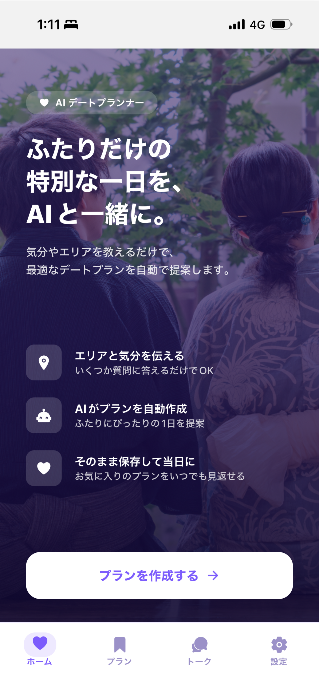
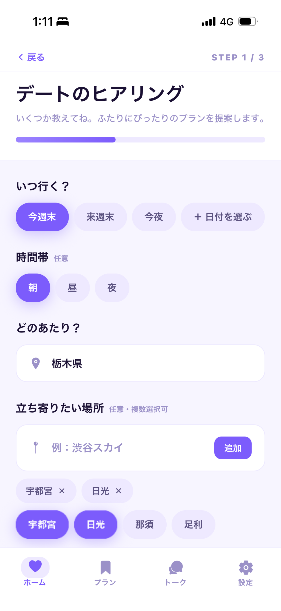
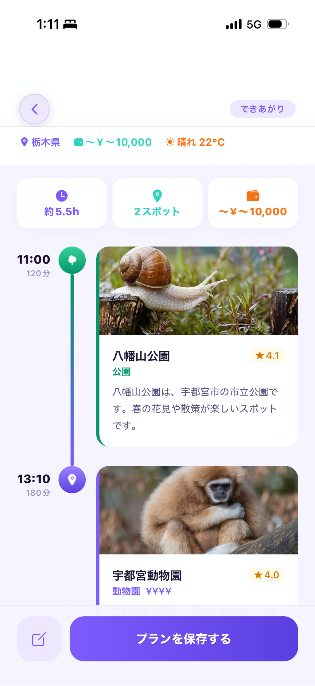
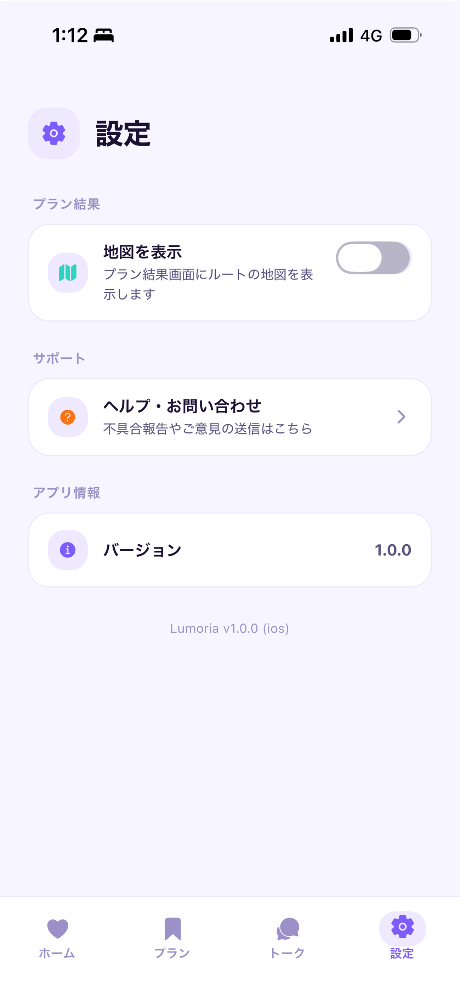
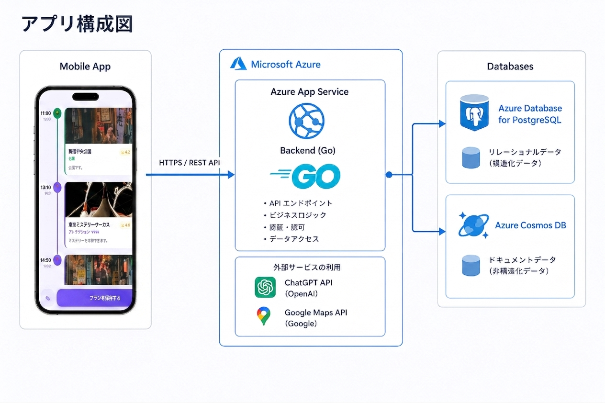

# DatePlan-app

**AIとリアルタイム情報でお出かけプランを自動生成するデートプラン作成アプリ**

行き先選びに悩む時間を減らすことを目指し、LLMによるプラン生成と地図・天気・写真などの外部APIを組み合わせて、具体的なタイムラインを提案します。

### ターゲット
デートプランを考えるのが苦手な彼氏、彼女

### アプリダウンロードリンク
https://apps.apple.com/jp/app/lumoria/id6786768794

### iosアプリ写真

|  |  |  |  |  |  |
| :---: | :---: | :---: | :---: | :---: | :---: |

### アプリ構成図



---

## 📅 概要

- **リポジトリ**: [https://github.com/asamigentoku/DatePlan-app](https://github.com/asamigentoku/DatePlan-app)
- **構成**: Go(Gin) 製バックエンド + Expo(React Native) 製モバイルアプリ

ユーザーが指定したエリア・希望スポットをもとに、Groq（LLM、OpenAIへのフォールバック付き）でプラン本文を生成し、Google Places / Nominatim / Open-Meteo / Pixabay から取得した座標・天気・写真情報を組み合わせて1つのプランに仕上げます。

## ✨ 主な機能

1. **AIによるプラン生成**
   - Groq（`openai-go` 経由）にエリア・希望スポット・当日の天気を渡し、デートプラン本文を生成。
   - Groq がレート制限（429）を返した場合は OpenAI にフォールバック。
2. **スポット情報の自動付与**
   - Google Places API でスポットを検索し、Nominatim（失敗時は Google Geocoding）で座標を、Pixabay で参考写真を並行取得して各スポットに付与。
3. **天気情報の統合**
   - Open-Meteo から指定日の気温・降水確率・天気概況を取得し、プラン生成のコンテキストに反映。
4. **MongoDB によるキャッシュ**
   - スポット検索・座標・天気・画像の取得結果を MongoDB にキャッシュし、外部APIの呼び出し回数とレスポンス時間を削減。
5. **認証・お気に入り管理**
   - JWT 認証、ユーザーCRUD、スポットのお気に入り登録などを REST API として提供（PostgreSQL / GORM）。
6. **レートリミット**
   - プラン作成エンドポイントに IP 単位のトークンバケット式レートリミッタを適用し、外部APIの過負荷を防止。


## 🛠 技術スタック

| 分類 | 技術 |
| :--- | :--- |
| **Backend** | Go, Gin, GORM |
| **Mobile** | Expo (React Native), Expo Router, TanStack Query |
| **Database** | PostgreSQL（ユーザー等）, MongoDB（外部APIキャッシュ） |
| **AI / LLM** | Groq（OpenAI互換API）, OpenAI（フォールバック） |
| **外部API** | Google Places API, Nominatim, Open-Meteo, Pixabay |
| **APIドキュメント** | OpenAPI (swaggo), Orval（フロント向け型生成） |

## 📂 ディレクトリ構成

```
.
├── backend/    # Go(Gin) API サーバー
│   ├── cmd/server        # エントリポイント
│   └── internal/
│       ├── handler/      # HTTPハンドラ
│       ├── service/      # ビジネスロジック（プラン生成など）
│       ├── client/       # 外部API連携（Google, Groq, OpenAI, Pixabay 等）
│       ├── repository/   # DB/キャッシュアクセス
│       └── middleware/   # 認証・CORS・レートリミット
├── mobile/     # Expo(React Native) アプリ
├── spec/       # API仕様関連
├── infra/      # インフラ定義
├── nginx/      # Nginx設定
└── docker-compose.yml
```

## 📦 セットアップ

### 環境変数

`.env.example` を参考に `.env` を作成してください。

```bash
cp .env.example .env
```

| 変数 | 説明 |
| :--- | :--- |
| `JWT_SECRET` | JWT署名用シークレット |
| `GOOGLE_MAP_API_KEY` | Google Maps / Places API キー |
| `GROQ_API_KEY` | Groq APIキー |
| `OPENAI_API_KEY` | OpenAI APIキー（Groqのフォールバック用） |
| `PIXABAY_API_KEY` | Pixabay APIキー |
| `MONGO_DB_NAME` | 使用するMongoDBのDB名 |

### Docker Compose で起動（Nginx + Backend + PostgreSQL + MongoDB）

```bash
docker compose up --build
```

### バックエンドを個別に起動

```bash
cd backend
go mod tidy
go run cmd/server/main.go
```

### モバイルアプリを起動

```bash
cd mobile
npm install
npx expo start
```

## 📖 API ドキュメント

Swagger UI: `/swagger/index.html`（サーバー起動後）

バックエンドの変更後は以下でドキュメントを再生成します。

```bash
cd backend
swag init -g cmd/server/main.go
```

モバイル側の型は Orval で生成します。

```bash
cd mobile
npm run gen
```

## 🚀 今後の展望

- **ルート最適化**: スポット間の移動コストを考慮した訪問順序の自動最適化。
- **収益化**: 提案スポットへのアフィリエイト連携や予約機能の導入。
- **パーソナライズ**: ユーザーの過去の嗜好を学習した優先表示。