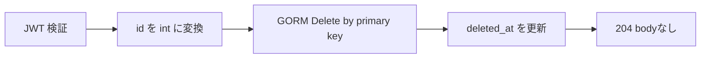

# DELETE /api/v1/users/{id}

## 概要

指定 ID のユーザーを論理削除する。Bearer JWT が必須。

## リクエスト

| Path | 型 | 必須 | 内容 |
| --- | --- | --- | --- |
| `id` | integer | 必須 | ユーザー ID |

```http
Authorization: Bearer <JWT>
```

## レスポンス

`204 No Content`

レスポンスボディはない。指定 ID が存在しなくても GORM の削除処理がエラーを返さなければ 204 となる。

## 内部処理



`gorm.Model` の `DeletedAt` を使用するため物理削除ではない。JWT の `sub` と対象 `id` の一致は確認しない。

## エラー

| ステータス | 条件 |
| --- | --- |
| 400 | `id` が整数でない |
| 401 | Bearer JWT なし、形式不正、署名不正 |
| 500 | PostgreSQL 削除失敗 |

## 実装箇所

- `backend/internal/handler/user_handler.go`
- `backend/internal/service/user_service.go`
- `backend/internal/repository/user_repository.go`

