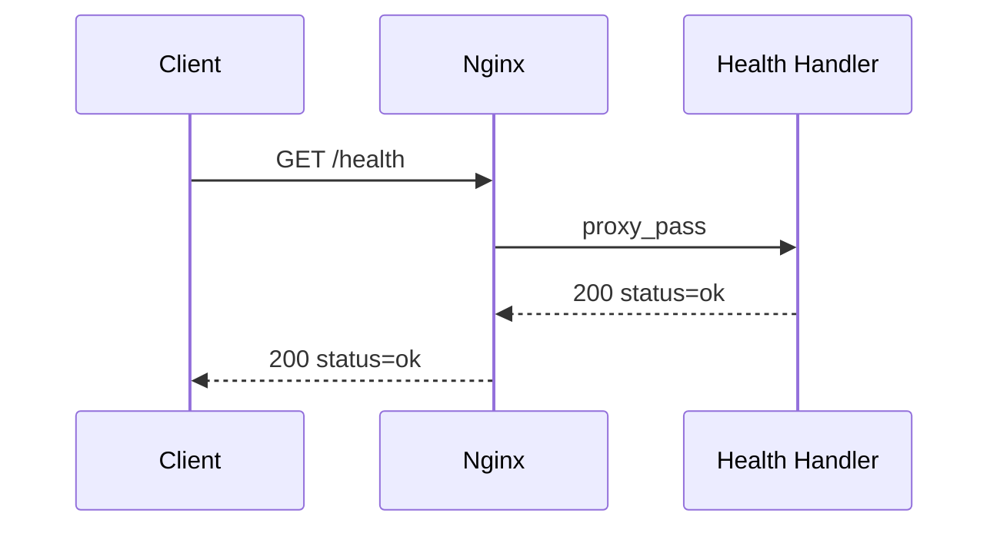

# GET /health

## 概要

API プロセスが HTTP 応答できることを確認する。認証と API ベースパスは不要で、Nginx のレート制限対象外である。

## リクエスト

パス、クエリ、ボディはない。

## レスポンス

`200 OK`

```json
{
  "status": "ok"
}
```

共通レスポンスエンベロープは使用しない。

## 内部処理



DB や外部 API の疎通確認は行わないため、PostgreSQL または MongoDB が起動後に停止していても 200 を返す。

## 実装箇所

- `backend/internal/router/main_router.go`
- `backend/internal/handler/health_handler.go`

