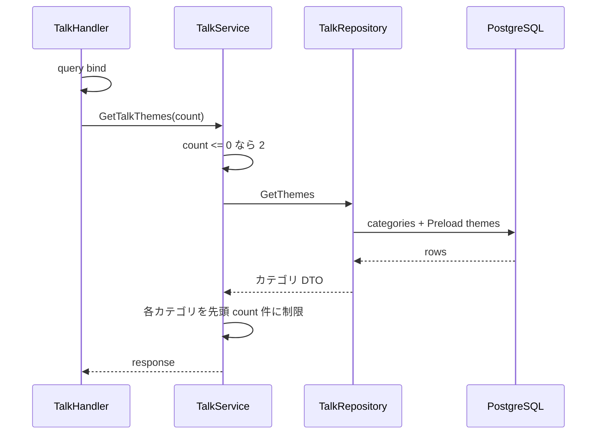

# GET /api/v1/talks/themes

## 概要

PostgreSQL に登録された会話テーマをカテゴリ別に返す。認証は不要。

## リクエスト

| Query | 型 | 必須 | 内容 |
| --- | --- | --- | --- |
| `count` | integer | 任意 | カテゴリごとの最大件数。省略または 0 以下は 2 |

例: `GET /api/v1/talks/themes?count=2`

## レスポンス

`200 OK`

```json
{
  "success": true,
  "data": {
    "categories": [
      {
        "label": "お互いを知る",
        "themes": [
          "子どもの頃の夢は何だった？",
          "一番の思い出の旅行先はどこ？"
        ]
      }
    ]
  }
}
```

`count` が登録数を超える場合は登録全件を返す。

## 内部処理



テーマはランダムではなく先頭から返す。SQL に明示的な並び順はない。

## エラー

| ステータス | 条件 |
| --- | --- |
| 400 | `count` を integer として解釈できない |
| 500 | PostgreSQL 取得失敗 |

## 実装箇所

- `backend/internal/router/talk_router.go`
- `backend/internal/handler/talk_handler.go`
- `backend/internal/service/talk_service.go`
- `backend/internal/repository/talk_repository.go`

