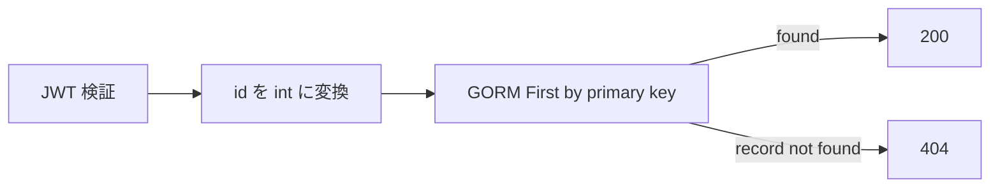

# GET /api/v1/users/{id}

## 概要

指定 ID のユーザーを取得する。Bearer JWT が必須。

## リクエスト

| Path | 型 | 必須 | 内容 |
| --- | --- | --- | --- |
| `id` | integer | 必須 | ユーザー ID |

```http
Authorization: Bearer <JWT>
```

## レスポンス

`200 OK`

```json
{
  "success": true,
  "data": {
    "ID": 1,
    "CreatedAt": "2026-09-02T00:00:00Z",
    "UpdatedAt": "2026-09-02T00:00:00Z",
    "DeletedAt": null,
    "name": "dateplan-user",
    "email": "user@example.com"
  }
}
```

## 内部処理



論理削除済みユーザーは GORM の既定スコープにより検索対象外となる。JWT の `sub` と `id` の一致は確認しない。

## エラー

| ステータス | 条件 |
| --- | --- |
| 400 | `id` が整数でない |
| 401 | Bearer JWT なし、形式不正、署名不正 |
| 404 | 指定ユーザーが存在しない、または論理削除済み |
| 500 | その他の PostgreSQL 取得失敗 |

## 実装箇所

- `backend/internal/handler/user_handler.go`
- `backend/internal/service/user_service.go`
- `backend/internal/repository/user_repository.go`

