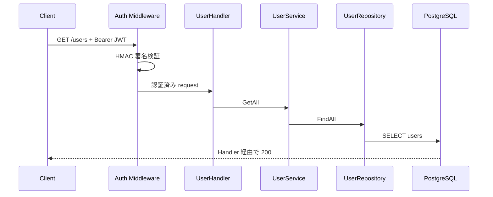

# GET /api/v1/users

## 概要

論理削除されていないユーザーを一覧取得する。Bearer JWT が必須。

## リクエスト

```http
Authorization: Bearer <JWT>
```

パス、クエリ、ボディはない。

## レスポンス

`200 OK`

```json
{
  "success": true,
  "data": [
    {
      "ID": 1,
      "CreatedAt": "2026-09-02T00:00:00Z",
      "UpdatedAt": "2026-09-02T00:00:00Z",
      "DeletedAt": null,
      "name": "dateplan-user",
      "email": "user@example.com"
    }
  ]
}
```

パスワードは JSON に含まない。現行 API は GORM モデルを直接返すため、監査フィールドも含まれる。

## 内部処理



取得順の指定とページネーションはない。JWT の利用者に関係なく全ユーザーを返す。

## エラー

| ステータス | 条件 |
| --- | --- |
| 401 | Bearer JWT なし、形式不正、署名不正 |
| 500 | PostgreSQL 取得失敗 |

## 実装箇所

- `backend/internal/handler/user_handler.go`
- `backend/internal/service/user_service.go`
- `backend/internal/repository/user_repository.go`

