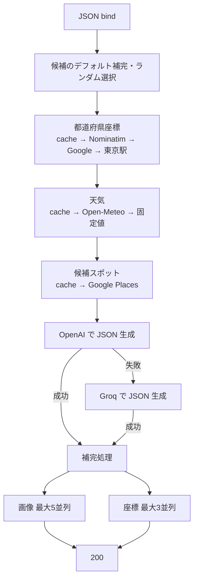

# POST /api/v1/plans

## 概要

入力された都道府県、候補エリア、希望場所、日付をもとに候補スポットと天気を取得し、LLM でデートプランを生成する。認証は不要。IP 単位のレート制限対象である。

## リクエスト

`Content-Type: application/json`

| フィールド | 型 | 必須 | 現行処理 |
| --- | --- | --- | --- |
| `theme` | string | 任意 | 受信するが未参照 |
| `budget` | integer / null | 任意 | 受信するが未参照 |
| `desired_places` | string[] | 任意 | 1 件をランダム選択。空なら `デートスポット` |
| `time_slot` | string | 任意 | 受信するが未参照 |
| `start_time` | integer / null | 任意 | 受信するが未参照 |
| `end_time` | integer / null | 任意 | 受信するが未参照 |
| `locations` | string[] | 任意 | 1 件をランダム選択。空なら `prefecture` |
| `relationship` | string / null | 任意 | 受信するが未参照 |
| `has_car` | boolean | 任意 | 受信するが未参照 |
| `prefecture` | string | 必須 | ジオコード、天気、fallback に使用 |
| `date` | string | 任意 | Open-Meteo の対象日。`YYYY-MM-DD` 想定 |

```json
{
  "theme": "落ち着いた休日デート",
  "budget": 10000,
  "desired_places": ["カフェ", "美術館"],
  "time_slot": "昼",
  "start_time": 1100,
  "end_time": 1900,
  "locations": ["上野", "浅草"],
  "relationship": "付き合いたて",
  "has_car": false,
  "prefecture": "東京都",
  "date": "2026-09-12"
}
```

## レスポンス

`200 OK`

| フィールド | 型 | 内容 |
| --- | --- | --- |
| `theme` | string | LLM が生成したテーマ |
| `weather.status` | string | 天気概況 |
| `weather.temperature` | number | 代表気温 |
| `weather.season` | string | 季節 |
| `description` | string | 全体説明 |
| `spots` | object[] | 訪問スポット |
| `movements` | object[] | スポット間移動 |

`spots` の要素:

| フィールド | 型 | 内容 |
| --- | --- | --- |
| `order` | integer | 表示順 |
| `name` | string | スポット名 |
| `description` | string | 説明 |
| `photos` | string[] | Pixabay 画像 URL |
| `category` | string | カテゴリ |
| `stay_time` | integer | 滞在時間（分） |
| `price_range` | integer | 価格目安（円） |
| `indoor_outdoor` | string | 屋内・屋外区分 |
| `rating` | number | 評価 |
| `congestion` | integer | 混雑度 |
| `opening_hours` | object | `start`、`end` の時刻 |
| `lat` | number | 緯度 |
| `lng` | number | 経度 |

`movements` の要素:

| フィールド | 型 | 内容 |
| --- | --- | --- |
| `order` | integer | 表示順 |
| `from` | string | 出発スポット |
| `to` | string | 到着スポット |
| `duration` | integer | 所要時間（分） |
| `method` | string | 移動方法 |

```json
{
  "success": true,
  "data": {
    "theme": "上野でアートとカフェを楽しむデート",
    "weather": {
      "status": "晴れ",
      "temperature": 25,
      "season": "秋"
    },
    "description": "美術館とカフェを巡るプランです。",
    "spots": [
      {
        "order": 1,
        "name": "国立西洋美術館",
        "description": "美術作品をゆっくり鑑賞します。",
        "photos": ["https://example.invalid/photo.jpg"],
        "category": "美術館",
        "stay_time": 120,
        "price_range": 500,
        "indoor_outdoor": "屋内",
        "rating": 4.5,
        "congestion": 3,
        "opening_hours": { "start": 9, "end": 17 },
        "lat": 35.7154,
        "lng": 139.7758
      }
    ],
    "movements": []
  }
}
```

テーマ、説明、評価、営業時間、移動情報などは LLM 出力であり、事実確認された値ではない。座標と画像は生成後に外部 API から補完する。

## 内部処理



画像と座標の補完は相互に並列実行する。キャッシュ、天気、画像、ジオコードの一部失敗は fallback または省略で継続する。Google Places 検索、OpenAI と Groq の両方、LLM JSON 解析の失敗は処理を終了する。

## エラー

| ステータス | 条件 | ボディ |
| --- | --- | --- |
| 400 | JSON 不正、`prefecture` が未指定 | 共通エンベロープ、`Invalid request format` |
| 429 | IP ごとのトークン不足 | `{"error":"too many requests, please try again later"}` |
| 500 | Places または LLM などの致命的失敗 | 共通エンベロープ、`internal server error` |

## 実装箇所

- `backend/internal/router/plan_router.go`
- `backend/internal/handler/plan_handler.go`
- `backend/internal/service/plan_service.go`
- `backend/internal/dto/plan_dto.go`

