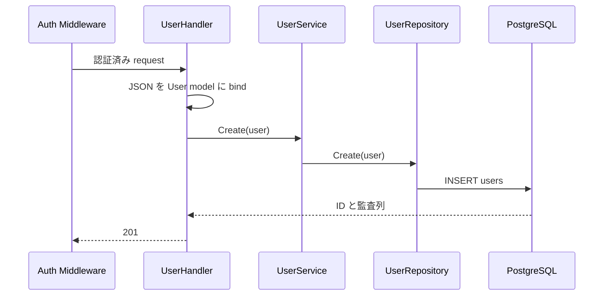

# POST /api/v1/users

## 概要

ユーザーを新規作成する。Bearer JWT が必須。現行 API 自体では JWT を発行しない。

## リクエスト

```http
Authorization: Bearer <JWT>
Content-Type: application/json
```

| フィールド | 型 | DB 制約 | 内容 |
| --- | --- | --- | --- |
| `name` | string | NOT NULL | 表示名 |
| `email` | string | NOT NULL、UNIQUE | メールアドレス |
| `password` | string | NOT NULL | パスワード |

```json
{
  "name": "dateplan-user",
  "email": "user@example.com",
  "password": "secret"
}
```

現行 Handler には required、メール形式、文字数、パスワード強度の検証がない。Go の空文字は DB 上の NULL ではないため、空文字が保存され得る。

## レスポンス

`201 Created`

```json
{
  "success": true,
  "data": {
    "ID": 1,
    "CreatedAt": "2026-09-02T00:00:00Z",
    "UpdatedAt": "2026-09-02T00:00:00Z",
    "DeletedAt": null,
    "name": "dateplan-user",
    "email": "user@example.com"
  }
}
```

## 内部処理



パスワードはハッシュ化せず DB に保存される。レスポンスではモデルの `json:"-"` により除外する。

## エラー

| ステータス | 条件 |
| --- | --- |
| 400 | JSON の型・形式が不正 |
| 401 | Bearer JWT なし、形式不正、署名不正 |
| 500 | email 重複を含む DB エラー |

## 実装箇所

- `backend/internal/handler/user_handler.go`
- `backend/internal/service/user_service.go`
- `backend/internal/repository/user_repository.go`
- `backend/internal/model/rds_models/user.go`

