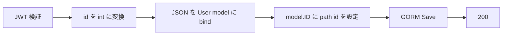

# PUT /api/v1/users/{id}

## 概要

指定 ID のユーザーを置換型で更新する。Bearer JWT が必須。

## リクエスト

| Path | 型 | 必須 | 内容 |
| --- | --- | --- | --- |
| `id` | integer | 必須 | ユーザー ID |

```http
Authorization: Bearer <JWT>
Content-Type: application/json
```

```json
{
  "name": "updated-user",
  "email": "updated@example.com",
  "password": "new-secret"
}
```

PATCH ではなく `GORM Save` を使用する。省略フィールドは Go のゼロ値になり、その値で保存される。JWT の `sub` と対象 `id` の一致は確認しない。

## レスポンス

`200 OK`

```json
{
  "success": true,
  "data": {
    "ID": 1,
    "CreatedAt": "2026-09-02T00:00:00Z",
    "UpdatedAt": "2026-09-02T00:01:00Z",
    "DeletedAt": null,
    "name": "updated-user",
    "email": "updated@example.com"
  }
}
```

## 内部処理



現行処理は事前存在確認をしない。GORM `Save` は対象行が存在しない場合に作成へフォールバックし得るため、未登録 ID でも 404 にはならない。

## エラー

| ステータス | 条件 |
| --- | --- |
| 400 | `id` が整数でない、または JSON 不正 |
| 401 | Bearer JWT なし、形式不正、署名不正 |
| 500 | unique 制約違反を含む DB エラー |

## 実装箇所

- `backend/internal/handler/user_handler.go`
- `backend/internal/service/user_service.go`
- `backend/internal/repository/user_repository.go`

