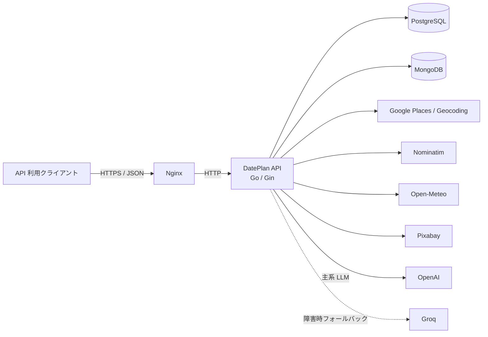

# DatePlan バックエンド 外部設計書

## 1. 文書情報

| 項目 | 内容 |
| --- | --- |
| 対象システム | DatePlan API サーバー |
| 対象範囲 | `backend/` およびバックエンドを公開する Nginx・データストア・外部 API |
| 対象外 | Expo / React Native 製フロントエンド、端末内データ、画面・画面遷移 |
| 基準 | 2026-09-02 時点のリポジトリ実装 |
| API バージョン | v1 |

本書は、利用者または外部システムから見えるバックエンドの振る舞いを定義する。内部のクラス構成、アルゴリズム、テーブル・コレクションの詳細は [内部設計書](./internal-design.md) を参照すること。

## 2. システム概要

DatePlan API は、指定された都道府県、エリア、希望場所、日付をもとに、周辺スポットと天気を収集し、LLM によってデートプランを生成する REST API である。会話テーマの取得、ユーザー情報の CRUD、死活監視用 API も提供する。



## 3. 提供機能

| 機能 | 概要 | 認証 |
| --- | --- | --- |
| ヘルスチェック | API プロセスの応答確認 | 不要 |
| デートプラン生成 | 外部 API と LLM を利用してプランを生成 | 不要 |
| 会話テーマ取得 | カテゴリ別の会話テーマを取得 | 不要 |
| ユーザー管理 | ユーザー一覧・詳細・作成・更新・論理削除 | Bearer JWT 必須 |

次の機能は README やルート直下の `openapi.yaml` に記載があるが、現行バックエンドには実装されていない。

- ログイン、JWT 発行
- お気に入り登録・一覧
- プラン履歴・プラン保存
- プラン共有 URL 発行
- 交通経路の外部 API 検索

## 4. API 共通仕様

### 4.1 接続仕様

| 項目 | 仕様 |
| --- | --- |
| API ベースパス | `/api/v1` |
| ヘルスチェック | `/health`（ベースパス外） |
| Swagger UI | `/swagger/index.html` |
| データ形式 | JSON |
| 文字コード | UTF-8 |
| 日付表現 | `YYYY-MM-DD` を想定 |
| 認証ヘッダー | `Authorization: Bearer <JWT>` |

### 4.2 通常レスポンス形式

ヘルスチェックと DELETE 成功を除き、API は原則として次の共通エンベロープを返す。

```json
{
  "success": true,
  "data": {}
}
```

エラー時は次の形式となる。

```json
{
  "success": false,
  "error": "error message"
}
```

### 4.3 HTTP ステータス

| ステータス | 用途 |
| --- | --- |
| `200 OK` | 取得・更新・プラン生成成功 |
| `201 Created` | ユーザー作成成功 |
| `204 No Content` | ユーザー削除成功、CORS プリフライト成功 |
| `400 Bad Request` | JSON、クエリまたはパスパラメータ不正 |
| `401 Unauthorized` | Bearer JWT がない、形式不正、署名不正 |
| `404 Not Found` | ユーザーが存在しない、または未定義パス |
| `429 Too Many Requests` | レート上限超過 |
| `500 Internal Server Error` | DB、外部 API、LLM またはサーバー内部の失敗 |

### 4.4 認証・認可

- `/api/v1/users` 以下は Bearer JWT を要求する。
- JWT は HMAC 署名で検証し、署名鍵には `JWT_SECRET` を使用する。
- `sub` クレームがある場合はリクエストコンテキストの `userID` に設定する。
- 現行 API には JWT 発行エンドポイントがないため、トークンは別手段で発行する必要がある。
- 現行実装は、JWT の利用者と操作対象ユーザー ID の一致を確認しない。認証済み利用者はすべてのユーザー CRUD を呼び出せる。

### 4.5 CORS

| ヘッダー | 値 |
| --- | --- |
| `Access-Control-Allow-Origin` | `*` |
| `Access-Control-Allow-Methods` | `GET,POST,PUT,DELETE,OPTIONS` |
| `Access-Control-Allow-Headers` | `Origin, Content-Type, Authorization` |

### 4.6 レート制限

- アプリケーション内では `POST /api/v1/plans` のみが対象である。
- クライアント IP ごとにトークンバケットを持ち、初期・最大バーストは 3 リクエスト、継続レートは 12 秒に 1 リクエストである。
- 3 分間アクセスのない IP 情報はメモリから削除される。
- Nginx 構成を利用する場合、`/api/` 全体に IP ごと 10 リクエスト/秒、バースト 20 の追加制限が設定される。
- 制限状態はプロセス間で共有されない。

## 5. API 一覧

| Method | Path | 機能 | 認証 | 主な成功コード |
| --- | --- | --- | --- | --- |
| GET | [`/health`](./endpoints/get-health.md) | ヘルスチェック | 不要 | 200 |
| POST | [`/api/v1/plans`](./endpoints/post-plans.md) | デートプラン生成 | 不要 | 200 |
| GET | [`/api/v1/talks/themes`](./endpoints/get-talk-themes.md) | 会話テーマ取得 | 不要 | 200 |
| GET | [`/api/v1/users`](./endpoints/get-users.md) | ユーザー一覧取得 | 必須 | 200 |
| GET | [`/api/v1/users/{id}`](./endpoints/get-user-by-id.md) | ユーザー詳細取得 | 必須 | 200 |
| POST | [`/api/v1/users`](./endpoints/post-users.md) | ユーザー作成 | 必須 | 201 |
| PUT | [`/api/v1/users/{id}`](./endpoints/put-user-by-id.md) | ユーザー更新 | 必須 | 200 |
| DELETE | [`/api/v1/users/{id}`](./endpoints/delete-user-by-id.md) | ユーザー論理削除 | 必須 | 204 |

## 6. API 詳細

エンドポイントごとの入出力、内部処理、エラー条件は [エンドポイント設計一覧](./endpoints/README.md) に分割している。

## 7. 外部サービス I/F

| サービス | 用途 | 認証 | 障害時の動作 |
| --- | --- | --- | --- |
| Nominatim | 都道府県・スポット名のジオコーディング | User-Agent | Google Geocoding へ切替 |
| Google Geocoding API | ジオコーディングの代替 | API キー | 都道府県は東京駅、スポットは都道府県座標を使用 |
| Google Places Text Search | 候補スポット検索 | API キー | プラン生成を 500 で終了 |
| Open-Meteo Forecast | 指定日の天気取得 | 不要 | 固定の晴天データを使用して継続 |
| OpenAI Chat Completions | JSON 形式のプラン生成（主系） | API キー | Groq へ切替 |
| Groq OpenAI-compatible API | LLM の代替 | API キー | プラン生成を 500 で終了 |
| Pixabay | 各スポットの画像検索 | API キー | 対象スポットの画像を空のまま継続 |

外部 API との通信はすべてサーバーからの HTTPS で行う。現行 HTTP クライアントには明示的なタイムアウト設定がない。

## 8. 可用性・性能・運用仕様

- PostgreSQL と MongoDB は API 起動時の必須依存先であり、接続または初期化に失敗するとプロセスを開始しない。
- PostgreSQL の接続プールは最大 100 接続、アイドル最大 10 接続、接続寿命 1 時間である。
- MongoDB の初回接続と Ping のタイムアウトは 10 秒である。
- MongoDB キャッシュにより外部 API 呼び出しを抑制する。場所・画像・天気は 24 時間、座標は 30 日で失効する。
- スポット画像は最大 5 並列、スポット座標は最大 3 並列で取得し、両処理も相互に並列実行する。
- アクセスログには HTTP メソッド、パス、ステータス、処理時間、クライアント IP を記録する。
- `/health` は Nginx レート制限およびアクセスログの対象外である。
- Nginx の API 上流タイムアウトは接続 10 秒、送受信 60 秒である。

## 9. 環境変数

| 変数 | 必須度 | 内容 | デフォルト |
| --- | --- | --- | --- |
| `ENV` | 任意 | 実行環境。`production` で Gin release mode | `development` |
| `PORT` | 任意 | API 待受ポート | `8080` |
| `DATABASE_URL` | 必須 | PostgreSQL DSN | なし |
| `MONGO_URI` | 必須 | DB 名をパスに含む MongoDB URI | なし |
| `JWT_SECRET` | ユーザー API 利用時必須 | JWT HMAC 署名鍵 | なし |
| `GOOGLE_MAP_API_KEY` | プラン生成時必須 | Google Places / Geocoding API キー | なし |
| `OPENAI_API_KEY` | プラン生成時必須 | OpenAI API キー | なし |
| `GROQ_API_KEY` | フォールバック利用時必須 | Groq API キー | なし |
| `PIXABAY_API_KEY` | 画像取得時必須 | Pixabay API キー | なし |

`MONGO_DB_NAME` は Docker Compose と `.env.example` に存在するが、現行 Go 実装では参照されない。DB 名は `MONGO_URI` の URL パスから取得する。

## 10. 現行実装上の注意事項

この節は将来仕様ではなく、運用・改修時に認識すべき現状を示す。

1. ルート直下の `openapi.yaml` は現行ルーティング・DTO・共通レスポンス形式と一致しない箇所がある。実行コードまたは生成済み Swagger を優先する。
2. ユーザー API 用 JWT の発行経路がなく、対象ユーザー単位の認可もない。
3. ユーザーパスワードはハッシュ化せず PostgreSQL に保存される。
4. ユーザーの入力モデルと出力モデルに DB モデルを直接使用している。
5. プランリクエストの多くの項目は生成プロンプトへ反映されていない。
6. LLM の JSON 出力に対するスキーマ検証・再試行はなく、JSON 解析失敗時は 500 となる。
7. 外部 API の明示的タイムアウト、リトライ、サーキットブレーカーはない。
8. ルートの `docker-compose.yml` にある MongoDB URI は DB 名のパスを含まないため、そのままでは起動時検証に失敗する。また Nginx の volume 元パスは実際の `nginx/default.conf` と一致していない。
9. MongoDB 切断処理は定義されているが、サーバー終了時には呼び出されていない。
