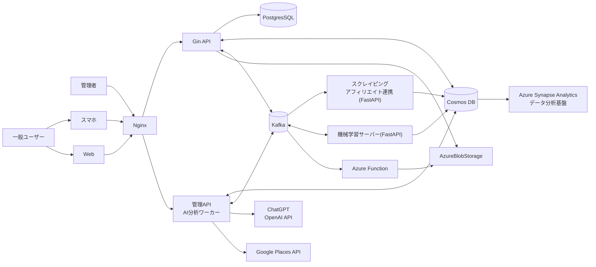

```mermaid
flowchart LR
    User["一般ユーザー"]
    Admin["管理者"]
    Mobile["スマホ"]
    Web["Web"]
    Nginx["Nginx"]
    Gin["Gin API"]
    AdminAPI["管理API<br/>AI分析ワーカー"]
    CosmosDB[("Cosmos DB")]
    Kafka[("Kafka")]
    Scraping["スクレイピング<br/>アフィリエイト連携 (FastAPI)"]
    ML["機械学習サーバー(FastAPI)"]
    PostgresSQL[("PostgresSQL")]
    AzureFunction["Azure Function"]
    AzureBlobStorage["AzureBlobStorage"]
    ChatGPT["ChatGPT<br/>OpenAI API"]
    GooglePlaces["Google Places API"]
    AzureSynapseAnalytics["Azure Synapse Analytics<br/> データ分析基盤"]

    User --> Mobile
    User --> Web

    Mobile --> Nginx
    Web --> Nginx
    Admin --> Nginx

    Nginx --> Gin
    Nginx --> AdminAPI
    
    Gin --> PostgresSQL

    Gin <--> CosmosDB
    Gin <--> Kafka
    Gin -->AzureBlobStorage

    AdminAPI <--> CosmosDB
    AdminAPI <--> Kafka

    Kafka --> Scraping
    Kafka <--> ML
    Kafka --> AzureFunction
    AdminAPI --> ChatGPT
    AdminAPI --> GooglePlaces

    Scraping --> CosmosDB
    CosmosDB --> AzureSynapseAnalytics
    ML --> CosmosDB
    AzureFunction --> AzureBlobStorage
```