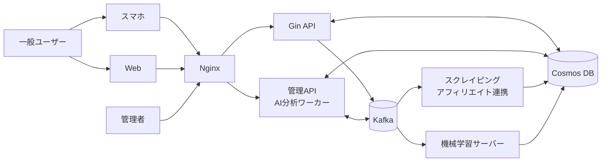

```mermaid
flowchart LR
    User["一般ユーザー"]
    Admin["管理者"]
    Mobile["スマホ"]
    Web["Web"]
    Nginx["Nginx"]
    Gin["Gin API"]
    AdminAPI["管理API<br/>AI分析ワーカー"]
    CosmosDB[("Cosmos DB")]
    Kafka[("Kafka")]
    Scraping["スクレイピング<br/>アフィリエイト連携"]
    ML["機械学習サーバー"]

    User --> Mobile
    User --> Web

    Mobile --> Nginx
    Web --> Nginx
    Admin --> Nginx

    Nginx --> Gin
    Nginx --> AdminAPI

    Gin <--> CosmosDB
    Gin --> Kafka

    AdminAPI <--> CosmosDB
    AdminAPI <--> Kafka

    Kafka --> Scraping
    Kafka --> ML

    Scraping --> CosmosDB
    ML --> CosmosDB
```